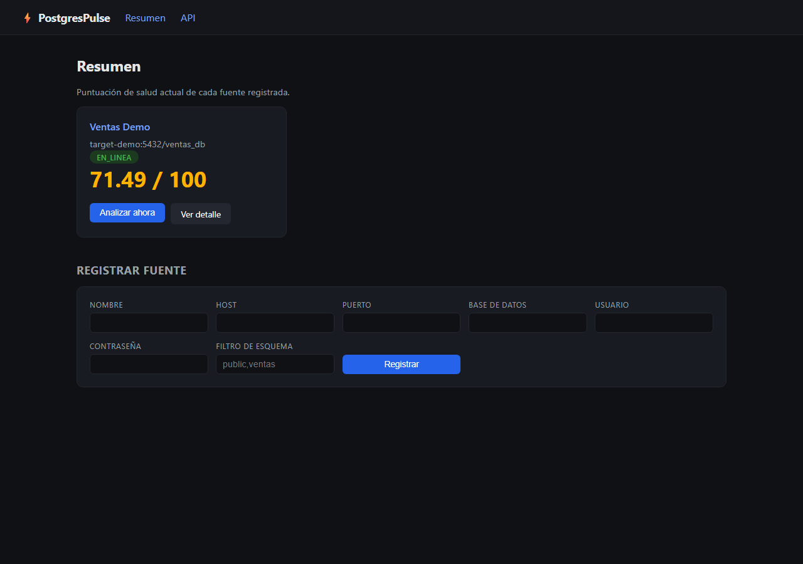
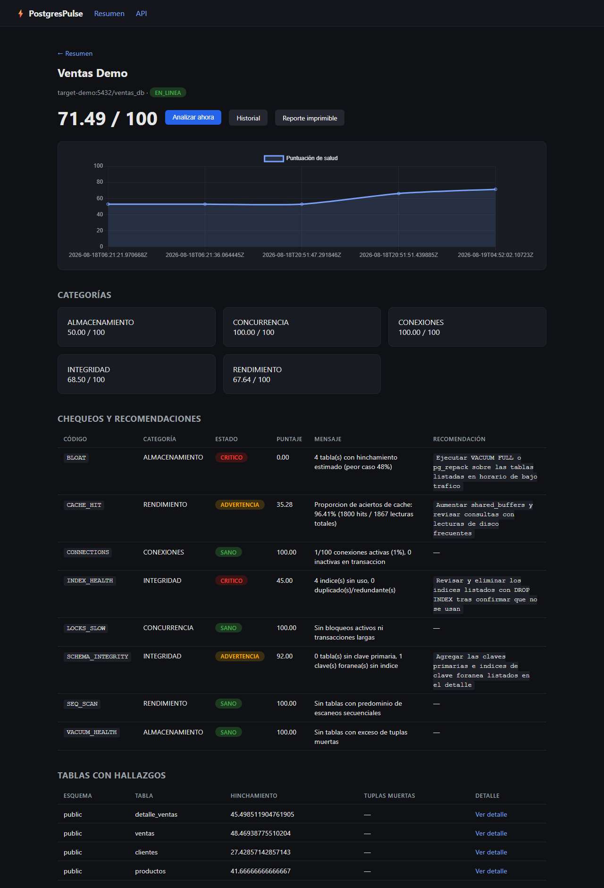
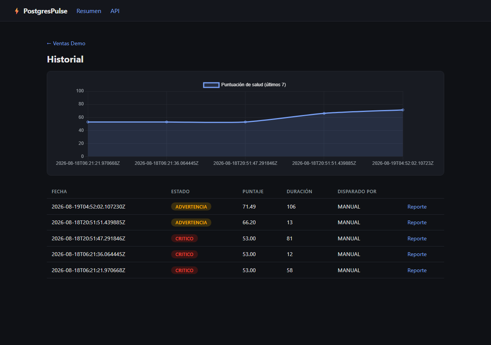

<div align="center">
  <h1>⚡ PostgresPulse</h1>
  <p><strong>"El electrocardiograma de tu base de datos" — Plataforma de análisis y salud de PostgreSQL</strong></p>

  [](https://github.com/SebastianMontes-Dev/PostgresPulse/actions/workflows/ci.yml)
  [](#)
  [](#)
  [](#)
  [](LICENSE)
</div>

<br/>

**PostgresPulse** se conecta a cualquier base de datos PostgreSQL en modo **solo-lectura**, ejecuta
**8 chequeos de diagnóstico profesional** (rendimiento, almacenamiento, integridad, concurrencia,
conexiones), calcula un **Índice de Salud (0–100)** ponderado por categoría, y entrega
**recomendaciones con SQL listo para ejecutar** — `CREATE INDEX`, `VACUUM`, `ALTER TABLE ADD PRIMARY KEY`
— junto con historial de tendencia, API REST documentada y un panel de control web que se
actualiza solo cada 30s (polling, no push/WebSocket — sigue haciendo falta "Analizar ahora" o el
programador por cron para que haya datos nuevos que mostrar).

Multi-fuente en tiempo de ejecución (registra fuentes sin reiniciar), credenciales cifradas
AES-256-GCM, modo SSL/TLS configurable por fuente (para bases remotas, no solo `localhost`),
garantía de solo-lectura a nivel de sesión PostgreSQL (nunca escribe en la BD analizada),
y despliegue con un solo comando de Docker Compose.

---

## ✨ Qué resuelve

Un DBA o backend que hereda una base de datos rara vez sabe por dónde empezar: ¿faltan índices? ¿hay
hinchamiento? ¿claves foráneas sin indexar arrastrando el rendimiento? PostgresPulse recorre los
catálogos del sistema (`pg_stat_*`, `pg_catalog`, `information_schema`) y convierte eso en un puntaje
único, hallazgos accionables y una tendencia histórica — sin instalar nada en la base objetivo. Un
umbral de alerta por fuente avisa por Email/Slack/PagerDuty cuando el puntaje cruza ese umbral, y un
stack Prometheus + Grafana opcional (`docker compose --profile monitoring up`) da la vista operativa
de la instancia completa.

---

## 🚀 Arranque en 3 comandos

```bash
git clone https://github.com/SebastianMontes-Dev/PostgresPulse.git
cd PostgresPulse
docker compose up -d --build
```

Levanta `pulse-db` (almacenamiento propio), `target-demo` (BD de ejemplo con datos de ventas
**mal modelados a propósito** — índices duplicados, claves foráneas sin índice, tabla sin clave
primaria, tuplas muertas) y `app`. La fuente `Ventas Demo` queda **registrada automáticamente**, sin
pasos manuales.

- Panel: [http://localhost:8080](http://localhost:8080) (usuario/contraseña: `admin`/`admin`)
- Swagger: [http://localhost:8080/swagger-ui.html](http://localhost:8080/swagger-ui.html)

Para recorrer el flujo completo (probar conexión → analizar → ver salud → exportar reporte) de una vez:

```bash
./scripts/demo.sh          # Linux/macOS/CI (requiere jq)
.\scripts\demo.ps1         # Windows PowerShell
```

Para ver el motor detectar hallazgos, aplicar las recomendaciones SQL sugeridas y re-analizar
mostrando la mejora real de puntaje (docs/SPECS.md §17):

```bash
./scripts/remediar-demo.sh    # Linux/macOS/CI (requiere jq)
.\scripts\remediar-demo.ps1   # Windows PowerShell
```

---

## 📸 Capturas

Panel real contra `target-demo`: puntuación de salud, tendencia recuperándose de **53.00 CRÍTICO**
a **71.49 ADVERTENCIA** tras aplicar las recomendaciones SQL del propio motor, y el detalle de
chequeos con hallazgos + SQL listo para ejecutar.

| Resumen | Detalle de fuente (chequeos + SQL) |
|---|---|
|  |  |

| Historial de tendencia |
|---|
|  |

---

## 🩺 Los 8 chequeos

| # | Chequeo | Categoría (peso) | Qué detecta | Umbrales | Recomendación |
|---|---|---|---|---|---|
| 1 | `CACHE_HIT` | Rendimiento (30%) | Proporción de aciertos de caché de buffers | <99% ⚠️ · <95% 🔴 | Subir `shared_buffers`, revisar consultas |
| 2 | `SEQ_SCAN` | Rendimiento (30%) | Escaneo secuencial vs. por índice | ratio >0.5 ⚠️ | `CREATE INDEX` sugerido por columna |
| 3 | `VACUUM_HEALTH` | Almacenamiento (25%) | Tuplas muertas vs. umbrales de autovacuum | >20% ⚠️ · >40% 🔴 | `VACUUM`, ajustar `autovacuum_vacuum_scale_factor` |
| 4 | `BLOAT` | Almacenamiento (25%) | Hinchamiento estimado de tablas/índices | >20% ⚠️ · >40% 🔴 | `VACUUM FULL` / `pg_repack` |
| 5 | `INDEX_HEALTH` | Integridad (20%) | Índices sin uso, duplicados, superpuestos | 1–2 ⚠️ · ≥3 🔴 | `DROP INDEX` (con tamaño y ahorro) |
| 6 | `SCHEMA_INTEGRITY` | Integridad (20%) | Tablas sin PK, FK sin índice | cualquier hallazgo ⚠️ | `ADD PRIMARY KEY`, `CREATE INDEX` en FK |
| 7 | `LOCKS_SLOW` | Concurrencia (15%) | Bloqueos activos, transacciones >5min | >0 ⚠️/🔴 | Revisión de transacciones, `pg_terminate_backend` |
| 8 | `CONNECTIONS` | Conexiones (10%) | Uso de `max_connections` | >80% ⚠️ · >95% 🔴 | Cerrar inactivas, *connection pooling* |

**Puntuación global** = suma ponderada del promedio de cada categoría. Clasificación: **≥85 SANO** ·
**60–84 ADVERTENCIA** · **<60 CRÍTICO**. Detalle completo de umbrales y fuentes de datos en
[docs/SPECS.md §8](docs/SPECS.md).

---

## 🏗️ Arquitectura

```
Cliente (panel + API REST) ──HTTPS──▶ Reverse proxy (Caddy, TLS)──HTTP interno──▶ PostgresPulse (Spring Boot 3.5 / Java 21)
                                                                                          │
                                                             ┌────────────────────────────┴───────────────────────┐
                                                             │ conexiones en tiempo de ejecución (solo lectura)     │
                                                       ┌─────▼──────┐                                    ┌──────────▼─────────┐
                                                       │  pulse-db  │  BD propia (Flyway)                │ BD objetivo #1..N   │
                                                       │ fuentes,   │                                    │ (PostgreSQL 12–17)  │
                                                       │ análisis   │                                    └──────────────────────┘
                                                       └────────────┘
```

El demo local (`docker compose up`) expone la app en HTTP plano en `:8080` para arranque en 3 comandos
sin certificados; el reverse proxy solo entra en juego en producción — ver
[docs/DEPLOYMENT.md §4.6](docs/DEPLOYMENT.md).

| Categoría | Tecnología |
| :--- | :--- |
| **Framework** | Spring Boot 3.5.16, Java 21 |
| **Persistencia** | Spring Data JPA, driver PostgreSQL, Flyway |
| **Resiliencia** | Resilience4j (circuit breaker por fuente + reintento en fallos transitorios) |
| **Seguridad** | Spring Security (JWT + RBAC), AES-256-GCM, anti-fuerza-bruta, CSRF en el panel |
| **Observabilidad** | Actuator + Micrometer (métricas propias), exportador Prometheus, tablero Grafana de ejemplo (opcional), logs estructurados ECS |
| **Alertas** | Umbral por fuente, canales Email (SMTP)/Slack (webhook)/PagerDuty (Events API v2) |
| **UI** | Thymeleaf + Chart.js |
| **Pruebas** | JUnit 5, Mockito, Testcontainers, JaCoCo |

Patrones: Estrategia (`ChequeoAnalisis` + 8 implementaciones), Fábrica, Orquestador, Repositorio, DTO
estricto (nunca se exponen entidades JPA). Detalle de ADRs en [docs/SPECS.md §6](docs/SPECS.md).

---

## 🔌 API REST (`/api/v1`)

| Método | Ruta | Descripción |
|---|---|---|
| POST | `/auth/login` | Iniciar sesión → JWT |
| GET/POST | `/fuentes` | Listar (ADMIN/LECTOR) / registrar (ADMIN) fuentes |
| GET/PUT/DELETE | `/fuentes/{id}` | Detalle (ambos) / actualizar / eliminar (ADMIN) |
| POST | `/fuentes/{id}/probar` | Probar conexión (ADMIN) |
| POST | `/fuentes/{id}/analizar` | Ejecutar análisis, 8 chequeos (ADMIN) |
| GET | `/fuentes/{id}/analisis` | Historial paginado (ambos) |
| GET | `/fuentes/{id}/salud` | Puntaje actual + tendencia 7d (ambos) |
| GET | `/fuentes/{id}/tablas` \| `/consultas` \| `/indices` | Hallazgos del último análisis (ambos) |
| GET | `/analisis/{id}` | Análisis completo (ambos) |
| GET | `/analisis/{id}/exportar?formato=json\|csv\|html` | Reporte exportable (ambos) |
| GET/POST/DELETE | `/usuarios` | Gestión de usuarios y roles (solo ADMIN) |

JWT (`Authorization: Bearer`) en todas las rutas salvo `/actuator/health` y `/auth/**`; roles
**ADMIN**/**LECTOR** — ver [🔐 Seguridad](#-seguridad). Referencia completa con ejemplos `cURL` en
[docs/API.md](docs/API.md).

---

## 🔐 Seguridad

- **Solo-lectura garantizada a nivel de sesión PostgreSQL** (`SET SESSION CHARACTERISTICS AS
  TRANSACTION READ ONLY`), no solo a nivel de driver — verificado con prueba de integración.
- **Credenciales cifradas** AES-256-GCM con clave por variable de entorno; nunca se exponen en la API
  ni en logs.
- **RBAC + JWT**: múltiples usuarios con rol **ADMIN** (todo) o **LECTOR** (solo lectura), BCrypt +
  bloqueo anti-fuerza-bruta (`429` tras varios fallos) en el login. El panel usa una cookie httpOnly;
  clientes de la API adjuntan `Authorization: Bearer` — ver [docs/API.md §1](docs/API.md).
- **CSRF** activo en el panel de control (Thymeleaf); `/api/v1/**` exento para clientes no interactivos.
- **Timeouts agresivos** hacia la BD objetivo (conexión 5s, statement 30s, máx. 4 conexiones por
  fuente) para no afectar el sistema que se está analizando.
- **Aviso al arrancar** si `PULSE_ADMIN_USER`/`PASSWORD`, `PULSE_CRYPTO_KEY` o `PULSE_DB_PASSWORD`
  siguen en su valor de desarrollo por defecto — relevante porque el repositorio es público.
- **TLS terminado en reverse proxy** para producción (`deploy/docker-compose.prod.yml` + Caddy,
  certificado Let's Encrypt renovado automáticamente) — el demo local sirve HTTP plano a propósito
  para no requerir certificados. Detalle en [docs/DEPLOYMENT.md §4.6](docs/DEPLOYMENT.md).
- Divulgación responsable de vulnerabilidades: [SECURITY.md](SECURITY.md).

---

## 📚 Documentación

| Documento | Contenido |
|---|---|
| [docs/SPECS.md](docs/SPECS.md) | Especificación técnica y funcional completa, ADRs, criterios de aceptación |
| [docs/API.md](docs/API.md) | Referencia de API con ejemplos `cURL` |
| [docs/DEPLOYMENT.md](docs/DEPLOYMENT.md) | Variables de entorno, despliegue, operación, troubleshooting |
| [SECURITY.md](SECURITY.md) | Política de seguridad y divulgación responsable de vulnerabilidades |
| [CONTRIBUTING.md](CONTRIBUTING.md) | Cómo levantar el entorno, correr pruebas y proponer cambios |
| [ROADMAP.md](ROADMAP.md) | Alcance post-v1.0 (ideas exploratorias sin compromiso: multi-motor, auditoría, SaaS...) |
| [CHANGELOG.md](CHANGELOG.md) | Historial de versiones |

---

## 🧪 Pruebas

```bash
./mvnw verify
```

Unitarias (puntuación, cifrado, exportación, programador) + integración con **Testcontainers**
(motor de 8 chequeos contra esquemas sintéticos conocidos, API end-to-end, panel de control) +
gate de cobertura JaCoCo (≥80% en el motor de análisis). Requiere Docker corriendo.

---

## 🤝 Contribuciones

¡Las contribuciones, informes de problemas (*issues*) y solicitudes de nuevas características son
siempre bienvenidos!

---

<div align="center">
  <em>Desarrollado con ❤️ para la comunidad de código abierto de datos.</em>
</div>
